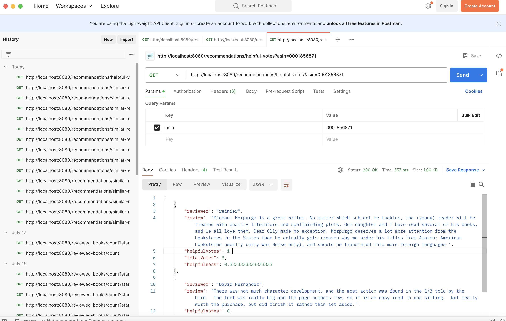

<h1><strong>Book Recommendation Data Pipeline</strong></h1>  

<h2><strong>Overview</strong></h2>

This repository contains a comprehensive data pipeline for creating a book recommendation system. The pipeline processes book metadata and reviews in JSON format, partitions and stores the data in S3 buckets, transforms the data, and loads it into a Neo4j database. The Neo4j database is then queried to serve recommendations through a FastAPI endpoint.

<h2><strong>Introduction</strong></h2>
This project is designed to provide an end-to-end solution for creating a book recommendation system. The pipeline takes raw book metadata and review data in JSON format, processes it, and stores it in S3 buckets. The data is then transformed and loaded into a Neo4j graph database, which is used to generate book recommendations. The recommendations are served via a FastAPI endpoint.

<h2><strong>Architecture</strong></h2>
The data pipeline consists of the following stages:

Data Ingestion: Collects book metadata and reviews in JSON format and partitions the data into chunks stored in S3 buckets.
Data Transformation: Extracts data from S3, transforms it, and loads it into a Neo4j graph database.
Data Serving: Uses FastAPI to serve book recommendations based on the Neo4j database.


<h2><strong>Technologies Used</strong></h2><br>

**Amazon S3**: For storage of raw and processed data.<br>
**Apache Spark**: For data transformation and partitioning.<br>
**Neo4j**: Graph database for storing book metadata and relationships.<br>
**FastAPI**: For serving book recommendations.<br>
**Docker**: For containerization of the application components.<br>
**Apache Airflow**: For ETL processes <br>

<h2><strong>Setup</strong></h2><br>

**Prerequisites** <br>
Docker <br>
Docker Compose <br>
AWS Account (with S3 and IAM setup)<br>
Python 3.8+<br>

<h2><strong>Data Snapshot</strong></h2> <br>

<i>meta_books.json</i> <br>
```json
{
  "asin": "0000913154",
  "title": "The Way Things Work: An Illustrated Encyclopedia of Technology",
  "price": 23.26,
  "imUrl": "http://ecx.images-amazon.com/images/I/7113akhDnTL.jpg",
  "related": {
    "also_bought": [
      "0590429892",
      "1114119512",
      "B000HW2YQE",
      "0395938473",
      "0395428572",
      "0449208133",
      "0486217094",
      "0618233784",
      "0486443604",
      "1856698769",
      "0942364155",
      "0936070129",
      "0671224549"
    ],
    "buy_after_viewing": [
      "0395938473",
      "B000GP0CT8",
      "0590429892",
      "1114119512"
    ]
  },
  "salesRank": {
    "Books": 455782
  },
  "categories": [
    ["Books"]
  ]
}
```
<br>

<i>reviews_books.json</i> <br>

```json
{
"reviewerID": "AFXV42SPFF6NZ",
"asin": "000171287X",
"reviewerName": "Concerned Christian",
"helpful": [0, 0],
"reviewText": "This is a book that I read over and over to my daughter and now I plan on reading it to my granddaughter.  Received it very quickly. Thanks!",
"overall": 5.0,
"summary": "Childhood memory",
"unixReviewTime": 1392249600,
"reviewTime": "02 13, 2014"
}
```
<br>

Data in S3 bucket
 <br>

Neo4j Graph diagram 
 <br>

Books bought after viewing others (shows BUY_AFTER_VIEWING relationship).
 <br>

Query returning books reviewed by similar reviewers
 <br>

API endpoint that returns for a specific book, the helpfulness of each review, and returns the top 10 reviews sorted by their helpfulness and the total number of votes. 
 <br>

ETL Pipeline set up in Airflow. 
 <br>


